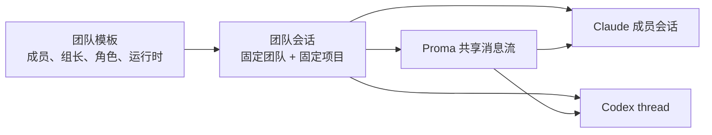

# Proma 团队多 Agent 协作实施计划

## 文档目的

本文面向负责实现 Proma 团队协作模块的工程师。读完后，应能直接完成领域建模、运行时接入、IPC、界面和验收工作，不需要再次决定核心产品行为。

本文描述的是第一版能力：团队独立维护，创建团队会话时选择项目，并在同一会话中通过 `@成员` 指定 Claude Code 或 Codex 执行任务。

## 调研结论

- [Gas Town](https://github.com/gastownhall/gastown) 把团队级配置与项目 Rig 分开，Agent 身份长期存在、运行会话按需创建。这与“先维护团队，再选择项目开工”最契合。
- [AionUi](https://github.com/iOfficeAI/AionUi) 通过统一协议接入多个本地 Agent，同时保留各 Agent 自己的认证、模型和工具。Proma 也应统一运行时接口，但不抹平 Claude Code 和 Codex 的原生能力。
- [1Code](https://github.com/21st-dev/1code) 和 [Scion](https://github.com/GoogleCloudPlatform/scion) 使用 Git worktree 隔离并行 Agent。Proma 第一版每条消息只允许一个成员执行，因此暂不引入 worktree；开放并行协作时再增加。
- [Agent Teams AI](https://github.com/777genius/agent-teams-ai) 会一次启动整个团队，随之需要处理成员存活、部分启动失败和复杂恢复。Proma 采用“消息发给谁，只启动或恢复谁”的懒启动模式。
- Codex 使用官方面向 GUI 客户端的 [Codex App Server](https://developers.openai.com/codex/app-server)，通过 JSON-RPC 管理 thread、turn、流式事件与审批，不使用偏自动化场景的 `codex exec`。
- Claude Code 使用本机 `claude` CLI 的流式 JSON、会话恢复及权限回调能力，复用用户现有 Claude 登录状态。参考 [Claude Code CLI](https://docs.anthropic.com/en/docs/claude-code/cli-usage)。

最终关系如下：



## 与现有能力的边界（Team ≠ Delegation）

仓库已有基于 Claude Agent SDK 的委派协作（`delegate_agent`、`parentSessionId` / `delegation*` 字段族）：由 LLM 自主决定是否分身子会话，且子会话仍走同一 SDK 主链路。

团队协作是另一条平行能力：

| | 现有委派 | 团队协作（本文） |
|--|----------|------------------|
| 触发方 | LLM 工具调用 | 用户 `@成员` 或默认组长 |
| 运行时 | 仅 Claude Agent SDK | Claude Code CLI / Codex App Server |
| 认证 | Channel + API Key | 本机 CLI 登录，绕开 Channel |
| 存储 | `agent-sessions*` | 独立的 `teams*` / `team-sessions*` |
| 会话树 | 父子委派树 | 扁平成员运行时引用 |

实现约束：

- 字段、IPC、atoms、侧栏列表、状态机全部独立，禁止复用 `sourceDelegationId` / `delegationRole` 等委派字段。
- 团队会话不出现在现有项目会话列表；委派子会话不出现在团队详情。
- 后续若要互通，单开里程碑，不在第一版混装。

## 核心领域设计

### 独立团队

- 在 Agent 模式增加独立的“团队”入口，与“项目”并列，不增加新的顶层应用模式。
- 侧栏实现参照现有「自动任务」合成组模式；团队入口拆成独立子组件再挂到 `LeftSidebar`，禁止继续向该巨石文件内堆叠逻辑。
- `AgentTeam` 只保存团队名称、描述、组长和成员模板，不绑定项目。
- 每个成员保存稳定 ID、名称、角色说明、`claude-code | codex` 运行时和 `read-only | workspace-write` 权限，默认 `workspace-write`。
- 创建团队会话时选择一个现有项目；生成后固定 `teamId + workspaceId`，不允许中途切换。
- 所有项目都可被任意团队选择；项目删除后，历史会话仍可查看，但禁止继续执行并提示项目已失效。
- 团队会话只显示在团队详情中，不混入现有项目会话列表。
- 团队会话支持停止当前 turn、归档与删除，行为对齐现有 Agent 会话的对应能力。

### 本地存储

延续项目现有的 JSON + JSONL 本地存储方式：

```text
~/.proma/
├── teams.json
├── team-sessions.json
└── team-sessions/
    └── {sessionId}.jsonl
```

- `TeamSessionMeta` 保存团队与项目快照、会话级状态和时间信息。
- JSONL 消息日志保存用户消息、成员回复、工具活动、审批及运行错误；每条消息带稳定 `messageId`。
- `TeamMemberRuntimeRef` 保存成员对应的 Claude session ID 或 Codex thread ID、成员级 turn 状态，以及共享上下文游标。
- 先持久化用户消息和运行状态，再启动本地 Agent；启动失败后保留会话，可原位重试。
- 团队成员被删除时使用软删除：历史消息继续显示原名称，但新消息不能再选择该成员。

### 状态机：会话级与成员级拆分

会话级 `TeamSessionMeta.status`：

- `idle` — 无进行中的成员 turn
- `active` — 至少一名成员正在执行
- `blocked` — 等待用户审批或 AskUser
- `archived` — 已归档，只读
- `failed` — 最近一次 turn 以不可恢复错误结束（可重试恢复为 idle/active）

成员级 `TeamMemberRuntimeRef.status`：

- `idle / starting / running / blocked / completed / failed / stopped`

UI 会话列表展示会话级状态；消息头与成员面板展示成员级状态。禁止把成员 turn 状态直接当作会话唯一状态。

### 共享上下文游标契约

现有 JSONL 为追加写入、无随机寻址。团队共享上下文游标约定如下：

- 游标类型：已成功注入给该成员的最后一条共享消息的 `messageId`（不是字节 offset）。
- 首次调用：注入团队说明、成员角色、项目路径/上下文，以及当前全部共享消息；成功后将游标设为最后一条消息 ID。团队说明与角色属于 bootstrap 提示，不计入共享消息游标。
- 后续调用：只注入游标之后新增的共享消息；全部成功注入后再推进游标。
- 注入失败或半成功：游标不推进，下次重试允许重复注入（成员原生会话侧需能容忍重复上下文，或由适配器做幂等去重）。
- 用户消息重试：不得再次追加同一条用户消息；仅对失败的成员 turn 重新发起执行。

## Agent 运行时架构

新增独立的 `TeamRuntimeAdapter` 深模块，**不改造**现有普通 Agent 主链路，也**不实现**现有 `AgentProviderAdapter`（该接口产出 `SDKMessage`，与 CLI / App Server 模型不匹配）。

适配器统一负责：

- 检测可执行文件、版本及登录状态。
- 创建、恢复和停止成员原生会话。
- 接收提示词和项目目录（cwd 固定为所选项目路径）。
- 将原生事件标准化为与现有 `AgentEvent` 兼容的最小子集（text / reasoning / tool_start / tool_result / approval / done / error），以便复用 `ToolActivityItem` / 消息列表等展示组件。
- 返回原生 session/thread ID 和运行能力。
- 将不同运行时的权限请求映射为独立的 `TeamApprovalRequest`（见下节），不得塞进现有 `PermissionRequest`。

### 与 Channel 的关系

团队路径完全绕开 Channel 体系：

- 不要求、不读取 API Key。
- 不调用 `assertEnabledModelForChannel` 等 channel 绑定工具。
- 第一版模型跟随各 CLI 本机默认；成员暂不配置独立 model 字段。后续若开放，在成员模板上单独加，仍不走 Channel。

### Skills / MCP

- 团队会话 cwd 为所选项目目录，因此会自然看到该工作区下的项目文件。
- 第一版：Claude Code 成员加载该项目工作区已有的 `mcp.json` / skills（与用户在该目录直接用 Claude CLI 一致）；Codex 成员按其 App Server / 项目配置加载，不强行对齐 Claude 的 MCP 形状。
- 不在团队层另维护一套 MCP/Skills 配置。

### 子进程生命周期

- 成员运行时按消息懒启动；进入团队会话页时不预启动整队。
- 同一成员同一时刻只允许一个执行中的 turn；若用户在 turn 未结束时再次发送给同一成员，拒绝发送并提示等待，或进入显式排队（第一版选拒绝，实现更简单）。
- 空闲超过 30 分钟的成员子进程可被回收；保留 `TeamMemberRuntimeRef` 中的原生 ID，下次按 resume 恢复。
- 应用退出时向所有活跃成员运行时发送停止信号并等待有界超时，超时后 force-kill。

### 权限：独立类型 + 双运行时映射

新建 `TeamApprovalRequest` 与同构但独立的审批 Banner，视觉可对齐现有权限 UI，类型与 atoms 队列独立（按 `teamSessionId + memberId` 隔离）。

成员权限语义：

| 成员权限 | Claude Code | Codex |
|----------|-------------|-------|
| `read-only` | 写文件 / 改系统类工具默认拒绝或强制审批 | approval-policy 偏只读；写入类审批拒绝或要求确认 |
| `workspace-write` | 仅允许在固定项目 cwd 内写入；目录外写入拒绝 | 同上，cwd 外写入拒绝 |

映射原则：

- 现有 `PermissionRequest` / `PromaPermissionMode`（`bypassPermissions | plan`）保持给 Claude Agent SDK 主链路专用。
- `TeamApprovalRequest` 携带：`teamSessionId`、`memberId`、`runtime`、`action`（read/write/exec 等）、`target`、`reason`、可选原始载荷摘要。
- UI 需可区分审批来自 Claude 还是 Codex（展示运行时标签）。

### Codex 适配器

- 维护一个受控的 `codex app-server` 子进程。
- 使用 `initialize`、`thread/start | resume`、`turn/start` 和通知事件。
- 将 Codex approval 映射到 `TeamApprovalRequest`。
- 启动时检查协议能力；版本不兼容时明确提示升级 Codex CLI。

### Claude Code 适配器

- 使用本地 `claude` CLI、流式 JSON 和 resume 能力。
- 通过 Claude 的 permission prompt tool 接入 Proma 内置权限 MCP 服务，再转为 `TeamApprovalRequest`。
- 复用本机 Claude Code 登录，不读取或保存用户 token。

团队配置页展示每种运行时的“已安装、版本、已登录、可用能力”状态。不可用成员仍可保存，但开始工作时必须给出可操作的修复提示。

## 会话路由与共享上下文

### `@` 提及改造范围

现网触发符分配：`@` 文件、`/` Skill、`#` MCP、`&` 其他 Agent 会话。团队成员**共用 `@`**，必须改造现有文件提及组件，而不是新增触发符。

实现要求：

- 修改 `file-mention-suggestion.tsx`（及分组渲染）：在团队会话输入中，`@` 建议列表分组为「团队成员」与「项目文件」；键盘上下键跨组连续导航。
- 仅在团队会话页启用成员分组；普通 Agent / Chat 输入不出现成员项。
- 发送载荷增加 `mentionedMemberId?: string`（单选）。一条消息最多一个成员 Mention；检测到多个成员时阻止发送并解释原因。
- 没有 Mention 时发送给团队组长。
- 被 Mention 的成员已删除或运行时不可用时，不自动转给其他成员，明确报错。
- 第一版不让组长自动拆任务、委派成员或同时启动多人。

### 共享记录

- Proma 的 JSONL 是团队会话唯一共享记录，各 Agent 的原生会话只负责保留该成员自己的执行上下文。
- 注入与游标规则见上文「共享上下文游标契约」。
- 消息头明确展示实际响应成员、运行时和成员级状态；工具活动复用现有 Agent 展示组件（事件已标准化为兼容子集）。

## 界面流程

- Agent 侧栏新增“团队”入口和团队数量（合成组 + 独立子组件）。
- 团队列表支持创建、编辑、删除团队。
- 团队编辑器支持添加任意数量成员、指定组长、成员角色、运行时和权限。
- 团队详情展示配置和历史会话，并提供“开始工作”。
- “开始工作”弹窗必须选择项目，随后创建固定项目的团队会话。
- 团队会话页复用 Agent 消息与输入组件，增加成员 Mention、运行时身份、会话级/成员级状态、停止/归档/删除。
- 第一版不增加任务看板、Agent 邮箱、自动委派、并行执行或 worktree 设置。

## IPC 与公开类型

- 在 `@proma/shared` 增加 Team 领域类型、会话/成员状态、标准化事件、`TeamApprovalRequest` 和 `TEAM_IPC_CHANNELS`。
- 主进程增加团队配置、会话 CRUD、发送、停止、归档/删除、审批应答、运行时健康检查等处理器。
- Preload 暴露对应的类型安全 API。
- 渲染进程使用独立的 Jotai team atoms；流式状态、审批队列和运行状态均按复合键 `` `${teamSessionId}:${memberId}` `` 隔离。
- 新增独立的 `useGlobalTeamListeners`，在 `main.tsx` 顶层常驻挂载；**禁止**把团队逻辑塞进现有 `useGlobalAgentListeners`。
- 切换页面时不得丢失流式输出或审批请求。

## 可靠性要求

- 成员运行时按消息懒启动，不在进入团队会话时启动整个团队。
- 启动、恢复、停止操作需要幂等保护；同一成员同一时刻只能存在一个执行中的 turn。
- 用户消息、目标成员和运行状态必须先落盘，运行时事件随后追加。
- 应用重启后，未结束会话通过原生 session/thread ID 恢复，不创建重复原生会话；游标按 `messageId` 续传，不重复推进。
- 权限请求按团队会话和成员隔离；切换页面后仍可继续处理。
- 运行时异常退出时记录明确错误，保留已产生的消息，并允许用户重试（不重复写入用户消息）。

## BDD 验收场景

- 创建一个包含 Claude Code 组长和 Codex 成员的团队，退出重启后配置仍存在。
- 进入团队、选择项目创建会话后，项目不可切换。
- 未 Mention 时只调用组长；`@Codex成员` 时只调用该成员。
- 一条消息 Mention 两个成员时禁止发送；普通 Agent 输入的 `@` 不出现团队成员分组。
- Claude 和 Codex 均复用本机登录，Proma 不要求配置 API Key，也不走 Channel。
- 首次调用成员能看到此前团队记录；恢复调用只收到游标后的新增消息；注入失败时游标不推进且可重试。
- 应用重启后：带原生 session/thread ID 的会话能恢复，且游标不导致重复推进。
- 同一成员在 turn 未结束时再次发送：被拒绝并提示，不并发启动第二个 turn。
- Codex App Server 或 Claude CLI 未安装、未登录、版本不兼容时显示准确状态和处理建议。
- `read-only` 成员修改文件时触发拒绝或审批；`workspace-write` 仅能在固定项目内写入；审批 UI 可区分 Claude / Codex 来源。
- 审批中途切页再回来仍可决策；流式响应与工具活动不丢失。
- Agent 启动失败后消息仍保留，可重试且不会重复写入用户消息。
- 删除成员或项目后，历史会话可读且不会错误调用其他成员。
- 会话可停止当前 turn、归档与删除。
- 完成后运行现有 typecheck、build 和相关 BDD 测试；不为简单 CRUD 堆叠单元测试。

## 默认决策与后续边界

- 团队是可复用模板，项目属于具体团队会话。
- Team ≠ Delegation：存储、IPC、UI、字段全部独立。
- 默认成员权限为 `workspace-write`，第一版不提供 full-access。
- 每条消息仅执行一个成员，默认组长，不自动委派。
- 第一版共享同一项目目录但不并行写入，因此不创建 worktree。
- 第一版绕开 Channel；模型用各 CLI 本机默认。
- 第一版 Skills/MCP 跟随项目工作区既有配置，团队层不另维护。
- 后续开放多成员并行时，再引入成员 worktree、任务看板、邮箱式消息和组长自动编排。
- 实现完成后递增 `@proma/shared` 与 `@proma/electron` patch 版本，并同步更新 `README.md` 和 `AGENTS.md`（改文档前仍需确认）。

## 推荐实施顺序

1. 建立 Team 共享类型、存储服务及 IPC 闭环，完成团队和团队会话 CRUD（含归档/删除与双层状态字段）。
2. 实现运行时注册表与健康检查，**先打通 Claude Code CLI 端到端**（路由、游标、事件持久化、`TeamApprovalRequest`），再接入 Codex App Server。
3. 与步骤 2 并行推进团队列表、编辑器、项目选择和团队会话界面；`@` 提及分组与审批 Banner 必须随第一个可运行时一起验收。
4. 补齐 Codex 适配器与双运行时 BDD 场景。
5. 端到端验证后更新版本号与项目说明文档。
