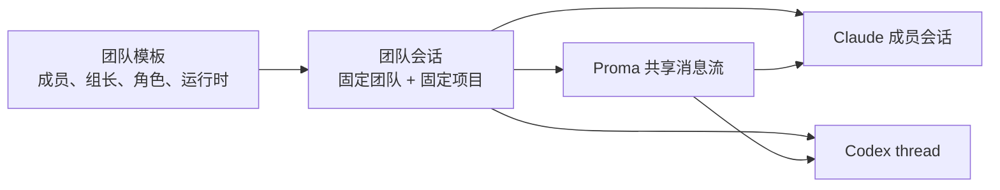

# Proma 团队多 Agent 协作实施计划

## 文档目的

本文面向负责实现 Proma 团队协作模块的工程师。读完后，应能直接完成领域建模、运行时接入、IPC、界面和验收工作，不需要再次决定核心产品行为。

本文描述的是第一版能力：团队独立维护，创建团队会话时选择项目，并在同一会话中通过 `@成员` 指定 Claude Code 或 Codex 执行任务。

## 调研结论

- [Gas Town](https://github.com/gastownhall/gastown) 把团队级配置与项目 Rig 分开，Agent 身份长期存在、运行会话按需创建。这与“先维护团队，再选择项目开工”最契合。
- [AionUi](https://github.com/iOfficeAI/AionUi) 通过统一协议接入多个本地 Agent，同时保留各 Agent 自己的认证、模型和工具。Proma 也应统一运行时接口，但不抹平 Claude Code 和 Codex 的原生能力。
- [1Code](https://github.com/21st-dev/1code) 和 [Scion](https://github.com/GoogleCloudPlatform/scion) 使用 Git worktree 隔离并行 Agent。Proma 第一版每条消息只允许一个成员执行，且**整个团队会话同一时刻只允许一个 turn**，因此暂不引入 worktree；开放并行协作时再增加。
- [Agent Teams AI](https://github.com/777genius/agent-teams-ai) 会一次启动整个团队，随之需要处理成员存活、部分启动失败和复杂恢复。Proma 采用“消息发给谁，只启动或恢复谁”的懒启动模式，但仍用会话级执行锁串行化 turn。
- Codex 使用官方面向 GUI 客户端的 [Codex App Server](https://developers.openai.com/codex/app-server)，通过 JSON-RPC 管理 thread、turn、流式事件与审批，不使用偏自动化场景的 `codex exec`。
- Claude Code 使用本机 `claude` CLI 的流式 JSON、会话恢复及权限回调能力，复用用户现有 Claude 登录状态。参考 [Claude Code CLI](https://docs.anthropic.com/en/docs/claude-code/cli-usage)。

最终关系如下：



## 与现有能力的边界（Team ≠ Delegation）

仓库已有基于 Claude Agent SDK 的委派协作（`delegate_agent`、`parentSessionId` / `delegation*` 字段族）：由 LLM 自主决定是否分身子会话，且子会话仍走同一 SDK 主链路。

团队协作是另一条平行能力：

| | 现有委派 | 团队协作（本文） |
|--|----------|------------------|
| 触发方 | LLM 工具调用 | 用户 `@成员` 或默认组长 |
| 运行时 | 仅 Claude Agent SDK | Claude Code CLI / Codex App Server |
| 认证 | Channel + API Key | 本机 CLI 登录，绕开 Channel |
| 存储 | `agent-sessions*` | 独立的 `teams*` / `team-sessions*` |
| 会话树 | 父子委派树 | 扁平成员运行时引用 |

实现约束：

- 字段、IPC、atoms、侧栏列表、状态机全部独立，禁止复用 `sourceDelegationId` / `delegationRole` 等委派字段。
- 团队会话不出现在现有项目会话列表；委派子会话不出现在团队详情。
- 禁止向团队成员注入 `collaboration` / `automation` 等会回到 Channel/Delegation/定时任务链路的内置 MCP。
- 后续若要互通，单开里程碑，不在第一版混装。

## 核心领域设计

### 独立团队

- 在 Agent 模式增加独立的“团队”入口，与“项目”并列，不增加新的顶层应用模式。
- 侧栏实现参照现有「自动任务」合成组模式；团队入口拆成独立子组件再挂到 `LeftSidebar`，禁止继续向该巨石文件内堆叠逻辑。
- `AgentTeam` 只保存团队名称、描述、组长和成员模板，不绑定项目。
- 每个成员保存稳定 ID、名称、角色说明、`claude-code | codex` 运行时和 `read-only | workspace-write` 权限，默认 `workspace-write`。
- 创建团队会话时选择一个现有项目（`AgentWorkspace`）；生成后固定 `teamId + workspaceId`，不允许中途切换。
- 所有项目都可被任意团队选择；项目删除后，历史会话仍可查看，但禁止继续执行并提示项目已失效。
- 团队会话只显示在团队详情中，不混入现有项目会话列表。
- 团队会话支持停止当前 turn、归档与删除，行为对齐现有 Agent 会话的对应能力。

### 团队快照与模板变更隔离

`AgentTeam` 是可编辑模板；已创建的团队会话必须与模板解耦，避免运行时身份与原生 session/thread 错位。

创建会话时，将下列字段**完整深拷贝**进 `TeamSessionMeta.teamSnapshot`（此后只读）：

- 团队名称、描述（展示用）
- 组长成员 ID
- 每位成员的：稳定 `memberId`、名称、角色说明、运行时（`claude-code | codex`）、权限（`read-only | workspace-write`）

规则：

- 会话内的 `@成员` 路由、权限、运行时选择**只读快照**，不回读最新 `AgentTeam`。
- 后续编辑团队模板（改角色、换运行时、换组长、增删成员）**只影响之后新建的会话**。
- 已有会话中：已被快照收录的成员即使在模板里软删除，仍可按其快照继续调用；模板新增的成员不会出现在旧会话的 `@` 列表。
- 因此不会出现「模板把成员从 Claude 改成 Codex，但 `TeamMemberRuntimeRef` 仍挂着旧 Claude session ID」的冲突。

### 本地存储

延续项目现有的 JSON + JSONL 本地存储方式：

```text
~/.proma/
├── teams.json
├── team-sessions.json
└── team-sessions/
    └── {teamSessionId}.jsonl
```

团队会话在所选工作区下的目录布局（对齐现有「会话隔离目录 + 工作区共享文件」模型，**不是**外部 Git 仓库路径）：

```text
~/.proma/agent-workspaces/{workspaceSlug}/
├── .claude-plugin/plugin.json        # ensurePluginManifest 保证存在；--plugin-dir 指向工作区根
├── mcp.json                          # 仅外部 MCP 可转换给 Claude CLI
├── skills/                           # 由工作区根 plugin 发现，不是 plugin 根目录
├── workspace-files/                  # 工作区共享文件（只读挂载给团队会话）
└── team-sessions/
    └── {teamSessionId}/              # 该团队会话的唯一 cwd（所有成员共享）
        ├── .context/                 # 会话临时工作台
        └── ...                       # 成员写入产物（可能含自写 .claude/，不得作为 settings 源）
```

说明：

- 现有普通 Agent 会话 cwd 是 `{slug}/{sessionId}/`，**不是**工作区根，也不是外部项目路径。团队会话同理：创建独立的 `team-sessions/{teamSessionId}/` 作为唯一 cwd。
- 第一版因会话级执行锁，全体成员共用同一 cwd，不创建 per-member worktree。
- `workspace-files/` 通过运行时 `additionalDirectories`（或等价只读挂载）暴露；默认不允许团队会话往该目录写入，写入目标仅限团队会话 cwd。
- `TeamSessionMeta` 保存 `teamSnapshot`（见上节）、项目快照、会话级状态、当前执行锁持有者（若有）和时间信息。
- JSONL 消息日志保存用户消息、成员回复、工具活动、审批及运行错误；每条消息带稳定 `messageId`。
- `TeamMemberRuntimeRef` 保存成员对应的 Claude session ID 或 Codex thread ID、成员级 turn 状态，以及共享上下文游标与最近一次上下文投递记录；运行时类型以快照为准，创建后不可变。
- 先持久化用户消息和运行状态，再启动本地 Agent；启动失败后保留会话，可原位重试。
- 团队模板中成员被删除时使用软删除：不影响已有会话快照；新会话不再包含该成员。历史消息继续显示原名称。

### 状态机：会话级与成员级拆分

会话级 `TeamSessionMeta.status`：

- `idle` — 无进行中的成员 turn，执行锁空闲
- `active` — 恰好一名成员正在执行（持有会话级执行锁）
- `blocked` — 持锁 turn 等待用户审批或 AskUser
- `interrupted` — 应用退出或崩溃打断了进行中的 turn（见「应用重启」）
- `archived` — 已归档，只读
- `failed` — 最近一次 turn 以错误结束（可重试）

成员级 `TeamMemberRuntimeRef.status`：

- `idle / starting / running / blocked / completed / failed / stopped / interrupted`

UI 会话列表展示会话级状态；消息头与成员面板展示成员级状态。禁止把成员 turn 状态直接当作会话唯一状态。

### 会话级执行锁（第一版强制串行）

「不并行、不使用 worktree」要求的是**整个团队会话串行**，而不仅是同一成员不重复执行：

- 任意成员处于 `starting / running / blocked` 时，整个会话禁止再发起任何 turn（包括发给其他成员）。
- 发送前主进程检查会话级锁；锁被占用时拒绝并提示「等待当前成员完成」。
- 渲染进程也应在发送前禁用输入/给出提示，但**以主进程校验为准**。
- 锁在 turn 进入 `completed / failed / stopped / interrupted` 后释放。
- 开放多成员并行时，再改为成员级锁 + worktree；第一版不做该切换开关。

### 共享上下文游标与投递语义

现有 JSONL 为追加写入、无随机寻址。上下文投递采用**至少一次（at-least-once）**，不承诺 exactly-once：

- 游标类型：已确认投递成功的最后一条共享消息的 `messageId`。
- 每次上下文注入带稳定 `deliveryId`，以及本次批次的 `messageIds[]`（首次调用另含 bootstrap 标记，bootstrap 本身不计入游标）。
- 首次调用：注入团队说明、成员角色、会话 cwd / `workspace-files` 说明，以及当前全部共享消息；确认成功后推进游标。
- 后续调用：只注入游标之后新增的共享消息；确认成功后再推进游标。
- 若原生 Agent 已收到上下文、Proma 却在确认前崩溃：游标不推进；下次用同一或新的 `deliveryId` 重投。适配器应让重复批次可识别（例如在注入文本中带 `deliveryId`），但**不保证**原生侧严格去重。
- 用户消息重试：不得再次追加同一条用户消息；仅对失败/中断的成员 turn 重新发起**新的** turn。

## Agent 运行时架构

新增独立的 `TeamRuntimeAdapter` 深模块，**不改造**现有普通 Agent 主链路，也**不实现**现有 `AgentProviderAdapter`（该接口产出 `SDKMessage`，与 CLI / App Server 模型不匹配）。

适配器统一负责：

- 检测可执行文件、版本、登录状态，以及 sandbox / 文件系统边界能力是否可用。
- 创建、恢复和停止成员原生会话。
- 接收提示词，并以团队会话目录为 cwd、按需挂载 `workspace-files/`。
- 显式注入 MCP / Skills（见下节），不得假设「设了 cwd 就会自动加载 Proma 配置」。
- 将原生事件标准化为与现有 `AgentEvent` 兼容的最小子集（text / reasoning / tool_start / tool_result / approval / done / error），以便复用 `ToolActivityItem` / 消息列表等展示组件。
- 返回原生 session/thread ID 和运行能力。
- 将不同运行时的权限请求映射为独立的 `TeamApprovalRequest`，不得塞进现有 `PermissionRequest`。

### 与 Channel 的关系

团队路径完全绕开 Channel 体系：

- 不要求、不读取 API Key。
- 不调用 `assertEnabledModelForChannel` 等 channel 绑定工具。
- 第一版模型跟随各 CLI 本机默认；成员暂不配置独立 model 字段。后续若开放，在成员模板上单独加，仍不走 Channel。

### 工作区目录、MCP 与 Skills 装载

**错误假设（已否定）**：把 cwd 设成工作区根或「项目路径」后，Claude/Codex 会自然加载 Proma 的 `mcp.json` 与 `skills/`。

事实：

- `AgentWorkspace` 没有外部项目路径字段；普通会话 cwd 是 `{slug}/{sessionId}/`。
- Proma 的 `mcp.json`、`skills/` 位于工作区配置层，由 Proma / Claude Agent SDK 主链路解释，**不是** Claude Code CLI 或 Codex 的默认发现位置。
- 现有**内置 MCP**（`kind=internal`，见 `builtin-mcp/default-mcp.json`）是 Claude Agent SDK **进程内对象**，不可序列化为 CLI 配置；其中 `collaboration`（含 `delegate_agent` 等）和 `automation` 会把成员重新拉回普通 Agent 的 Channel / Delegation / 定时任务链路，**破坏 Team ≠ Delegation**。

第一版装载规则：

| 资源 | 团队会话行为 |
|------|----------------|
| cwd | `.../agent-workspaces/{slug}/team-sessions/{teamSessionId}/` |
| 共享文件 | 只读挂载 `workspace-files/`（或等价 additionalDirectories） |
| Claude 外部 MCP | **仅**转换工作区 `mcp.json` 中的用户外部 MCP（stdio/sse 等可序列化项）为 Claude CLI 可消费配置，经受控临时配置 + `--strict-mcp-config` 传入 |
| Claude 权限 MCP | 单独提供 Team 专用权限 MCP stdio helper（见下节跨进程通信）；经 `--permission-prompt-tool` 指向该 MCP 工具；**不是**复用 SDK 进程内权限回调，也**不能**直接调 `ipcMain` |
| Claude 其他内置 MCP | 使用**明确白名单**；第一版默认**排除** `collaboration` 与 `automation`。白名单外一律不注入。当前其余内置（如 `nano_banana`）默认也不进白名单，除非后续单独评审打开 |
| Claude Skills | 启动前对所选工作区调用现有 `ensurePluginManifest(slug, name)`，保证 `{workspaceRoot}/.claude-plugin/plugin.json` 存在；Claude CLI 使用 `--plugin-dir <工作区根目录>`（即 `~/.proma/agent-workspaces/{slug}`）。**不要**把 `skills/` 本身当成 plugin 根目录 |
| Codex MCP/Skills | 第一版**不继承** Proma 工作区 MCP/Skills；仅使用 Codex 自身配置。UI 标明「Codex 成员不加载本工作区 MCP/Skills」 |
| 团队层配置 | 不另维护第二套工作区 MCP/Skills；外部 MCP/Skills 复用所选工作区文件，内置能力按上表白名单另议 |

**禁止**：把「内置 MCP 注入结果」整体导出或转发给 Claude CLI。

### Team 权限 MCP：跨进程通信

Claude CLI 会自行拉起 MCP **stdio 子进程**。该 helper 运行在 CLI 子树中，**无法**直接调用 Electron `ipcMain` / `webContents.send`。

第一版约定：

1. Electron 主进程为团队运行时维护本地 IPC endpoint：
   - macOS / Linux：Unix domain socket
   - Windows：named pipe
2. 每次启动 Claude turn 时生成一次性（或短 TTL）**capability token**，仅对该 `teamSessionId + memberId + turn` 有效。
3. 启动权限 MCP helper 时通过环境变量注入，例如：
   - `PROMA_TEAM_PERMISSION_ENDPOINT` — socket/pipe 路径
   - `PROMA_TEAM_PERMISSION_TOKEN` — capability token
   - 可选：`PROMA_TEAM_SESSION_ID` / `PROMA_TEAM_MEMBER_ID` / `PROMA_TEAM_TURN_ID`
4. Helper 作为标准 MCP server：CLI 经 `--permission-prompt-tool` 调用其工具；helper 将审批请求经 endpoint 转发到主进程，等待允许/拒绝/取消，并处理超时。
5. 主进程将请求转为 `TeamApprovalRequest` 推给渲染进程 Banner；用户应答后写回 helper；turn 结束或超时时取消未决请求并作废 token。
6. 协议至少覆盖：请求、响应、取消、超时；token 无效或 endpoint 不可达时 **fail closed**（拒绝工具调用）。

参考：Claude Code CLI 要求 `--permission-prompt-tool` 指向一个 MCP 工具。

### 子进程生命周期

两种运行时生命周期不同，第一版写死如下：

**Claude Code（每 turn 短进程）**

- 每个 turn 启动一个 `claude` 子进程（如 `claude -p` + 流式 JSON）；输出结束即退出。
- 通过持久化的 Claude session ID 在下一 turn **resume 上下文**，不常驻进程。
- 不存在「空闲 30 分钟回收 Claude」——进程在 turn 结束时已经退出。
- turn 进行中若应用退出：杀当前子进程，状态标 `interrupted`。

**Codex（App Server 常驻）**

- 维护受控的 `codex app-server` 长生命周期子进程；按 thread/turn API 驱动。
- 空闲超过 30 分钟可回收 App Server 进程；保留 thread ID，下次再拉起 server 后 resume。
- 应用退出时有界停止；进行中 turn 标 `interrupted`。

共通：

- 进入团队会话页时不预启动整队；Claude 尤其按消息懒启动。
- **会话级执行锁**：任意 turn 进行中时，禁止向任何成员发起新 turn。

### 权限：强制边界 + 隔离全部文件设置源

审批 Banner 与提示词**不能**单独构成安全边界。Bash、符号链接、绝对路径，以及 Claude 跨 scope 合并的数组型设置（`allowWrite`、权限规则、插件等），都可能扩大可写范围。官方设置文档明确：数组设置会跨 user/project/local 合并。sandbox 默认也可能逃逸到非 sandbox 命令，必须显式关闭。

额外风险：团队 cwd 对 `workspace-write` 成员可写，成员可在 cwd 写入 `.claude/settings.json`；若仍加载 **project** setting source，下一 turn 会经 project scope 合并扩大边界。因此仅排除 user/local **不够**。

强制要求：

1. **运行时 sandbox / 文件系统边界必须启用**，按成员权限配置：
   - `read-only`：禁止写入团队会话 cwd 与 `workspace-files/`（只读可见允许的目录）。
   - `workspace-write`：仅允许写入团队会话 cwd；`workspace-files/` 只读；cwd 外（含经 symlink / 绝对路径逃逸）一律拒绝。
2. **Claude Code 必须禁用全部文件设置源**，只使用 Proma 生成的受控配置：
   - 使用受控临时 `--settings`（只读临时文件），内容仅含本 turn 所需 sandbox / 权限配置。
   - **禁用 user、project、local 全部文件 setting sources**；不得加载用户全局配置，也不得加载团队 cwd 内成员自写的 `.claude/settings.json` / 项目级规则。
   - 启用 `--strict-mcp-config`，只使用本次显式传入的 MCP 配置（外部 mcp.json 转换结果 + Team 权限 MCP + 白名单内置），不合并用户或其他目录发现的 MCP。
   - sandbox 配置至少包含：`failIfUnavailable: true`、`allowUnsandboxedCommands: false`、`excludedCommands: []`（空数组，禁止额外放行）。
   - 可写根仅限团队会话 cwd。
   - 若 CLI 无法可靠禁用 project（或任一文件）setting source：必须叠加 **Proma 外层 OS sandbox**（如 macOS Seatbelt / Linux seccomp+landlock / Windows 等价作业约束）强制文件系统边界，并同样 fail closed；不得回退到「仅靠提示词或审批分类」。
3. Codex：使用 App Server 的 sandbox / approval-policy 等价能力做同样目录约束；不可用时同样 fail closed；必要时同样叠加 OS sandbox。
4. `TeamApprovalRequest` 仍用于用户确认（例如敏感命令），但是**叠加在** sandbox（及必要时 OS sandbox）之上，不是替代；请求经权限 MCP helper ↔ 主进程 endpoint 转发（见上节）。
5. 现有 `PermissionRequest` / `PromaPermissionMode` 保持给 Claude Agent SDK 主链路专用。
6. `TeamApprovalRequest` 携带：`teamSessionId`、`memberId`、`runtime`、`action`、`target`、`reason`、可选原始载荷摘要；UI 展示运行时标签以区分 Claude / Codex。

### Codex 适配器

- 维护一个受控的 `codex app-server` **常驻**子进程（唯一需要长驻的运行时）。
- 使用 `initialize`、`thread/start | resume`、`turn/start` 和通知事件。
- 强制启用与成员权限匹配的 sandbox；能力不足则 fail closed。
- 将 Codex approval 映射到 `TeamApprovalRequest`。
- 启动时检查协议能力；版本不兼容时明确提示升级 Codex CLI。
- 第一版不注入 Proma MCP/Skills。

### Claude Code 适配器

- 每个 turn 启动短生命周期 `claude` CLI 进程，流式 JSON 输出，结束后退出；下一 turn 用 session ID resume。
- 启动前：`ensurePluginManifest(workspaceSlug, workspaceName)`；CLI 传 `--plugin-dir <工作区根目录>`（不是 `skills/`）。
- 启动参数必须包含：受控 `--settings`、**禁用 user/project/local 全部文件设置源**、`--strict-mcp-config`、显式 MCP 配置、`--permission-prompt-tool` 指向 Team 权限 MCP 工具、`--plugin-dir`。
- MCP 仅含：工作区 `mcp.json` 外部项转换结果 + Team 权限 MCP（stdio helper + endpoint/token 环境变量）+ 白名单内置（默认无 collaboration/automation）。
- sandbox：`failIfUnavailable: true`、`allowUnsandboxedCommands: false`、空 `excludedCommands`；若无法隔离 project settings 则启用外层 OS sandbox；仍不可用则 fail closed。
- 复用本机 Claude Code 登录，不读取或保存用户 token。

团队配置页展示每种运行时的「已安装、版本、已登录、sandbox 可用、设置源隔离、权限 MCP endpoint、MCP/Skills 装载能力」状态。不可用成员仍可保存，但开始工作时必须给出可操作的修复提示。

## 会话路由与共享上下文

### `@` 提及：可持久化类型标识

现网触发符分配：`@` 文件、`/` Skill、`#` MCP、`&` 其他 Agent 会话。富文本序列化目前把所有 `@` Mention 写成 `@file:{id}`（见 `markdown-rich-text.ts`）。团队成员共用 `@` 时，**必须**扩展 Mention 节点类型，不能只增加发送载荷字段。

实现要求：

- Mention 节点增加 `mentionKind: 'file' | 'member'`（或等价 data 属性）。
- 序列化：文件仍为 `@file:{id}`；成员为稳定的 `@member:{id}`。
- 反序列化 / 草稿恢复 / 复制粘贴 / 消息重试均识别两种前缀；`remarkMentions` 与发送解析同步支持。
- 仅在团队会话页启用成员分组建议；普通 Agent / Chat 输入不出现成员项，也不接受 `@member:` 路由。
- 修改 `file-mention-suggestion.tsx`（及分组渲染）：团队会话中 `@` 建议列表分组为「团队成员」与「项目文件」；键盘上下键跨组连续导航。
- 发送载荷可带 `mentionedMemberId` 作为快捷字段，但**主进程必须以消息正文中的 `@member:{id}` 为准再解析并校验**：
  - 有效成员 Mention 至多一个；多个则拒绝。
  - 零个则路由给组长。
  - 成员已删除、不存在或运行时不可用：拒绝，不自动转交。
- 第一版不让组长自动拆任务、委派成员或同时启动多人。

### 共享记录

- Proma 的 JSONL 是团队会话唯一共享记录，各 Agent 的原生会话只负责保留该成员自己的执行上下文。
- 注入与游标规则见「共享上下文游标与投递语义」。
- 消息头明确展示实际响应成员、运行时和成员级状态；工具活动复用现有 Agent 展示组件（事件已标准化为兼容子集）。

## 界面流程

- Agent 侧栏新增“团队”入口和团队数量（合成组 + 独立子组件）。
- 团队列表支持创建、编辑、删除团队。
- 团队编辑器支持添加任意数量成员、指定组长、成员角色、运行时和权限。
- 团队详情展示配置和历史会话，并提供“开始工作”。
- “开始工作”弹窗必须选择项目，随后创建固定项目的团队会话，并在工作区下创建 `team-sessions/{teamSessionId}/`。
- 团队会话页复用 Agent 消息与输入组件，增加成员 Mention（来自会话 `teamSnapshot`，非实时模板）、运行时身份、会话级/成员级状态、执行锁占用提示、停止/归档/删除。
- Codex 成员旁标注不加载工作区 MCP/Skills；Claude 成员旁不暗示拥有委派/定时任务能力。
- 第一版不增加任务看板、Agent 邮箱、自动委派、并行执行或 worktree 设置。

## IPC 与公开类型

- 在 `@proma/shared` 增加 Team 领域类型、会话/成员状态、标准化事件、`TeamApprovalRequest`、`deliveryId` 相关类型和 `TEAM_IPC_CHANNELS`。
- 主进程增加团队配置、会话 CRUD、发送、停止、归档/删除、审批应答、运行时健康检查等处理器；发送路径必须做会话级锁与 `@member:` 校验。
- Preload 暴露对应的类型安全 API。
- 渲染进程使用独立的 Jotai team atoms；流式状态、审批队列和运行状态均按复合键 `` `${teamSessionId}:${memberId}` `` 隔离。
- 新增独立的 `useGlobalTeamListeners`，在 `main.tsx` 顶层常驻挂载；**禁止**把团队逻辑塞进现有 `useGlobalAgentListeners`。
- 切换页面时不得丢失流式输出或审批请求。

## 可靠性要求

- 成员运行时按消息懒启动：Claude 每 turn 短进程，Codex 按需使用常驻 App Server；不在进入团队会话时启动整个团队。
- 会话级执行锁 + 启动/恢复/停止幂等；同一团队会话同一时刻最多一个 turn。
- 用户消息、目标成员和运行状态必须先落盘，运行时事件随后追加。
- **应用重启不能恢复执行中的 turn**：
  - 启动恢复时，将仍为 `starting / running / blocked` 的会话与成员状态改为 `interrupted`（或可重试的 `failed`），保留已落盘的部分输出。
  - 可 resume 原生 session/thread **上下文**，但不得宣称继续被中断的那一次 turn。
  - 用户重试时创建**新的** turn，释放并重新获取会话级锁。
- 上下文投递为至少一次；用 `deliveryId` + `messageIds[]` 标识批次，重复可识别，不承诺 exactly-once。
- 权限请求按团队会话和成员隔离；切换页面后仍可继续处理；进行中审批在应用重启后随 turn 一并标为 `interrupted`，需用户重试后重新申请。
- 运行时异常退出时记录明确错误，保留已产生的消息，并允许用户重试（不重复写入用户消息）。

## BDD 验收场景

- 创建一个包含 Claude Code 组长和 Codex 成员的团队，退出重启后配置仍存在。
- 进入团队、选择项目创建会话后，项目不可切换；磁盘上出现 `team-sessions/{id}/` 作为 cwd；`teamSnapshot` 含完整成员运行时与权限拷贝。
- 创建会话后把模板中某成员从 Claude 改成 Codex：旧会话仍按快照用 Claude；新会话使用 Codex；旧会话原生 session ID 不与新运行时混用。
- 未 Mention 时只调用组长；正文含 `@member:{id}` 时只调用该成员。
- 一条消息出现两个 `@member:` 时主进程拒绝；草稿恢复后成员 Mention 仍为 `@member:` 而非 `@file:`。
- 普通 Agent 输入的 `@` 不出现团队成员分组。
- Claude 成员 turn 进行中时，向 Codex 成员发送被会话级锁拒绝。
- Claude 和 Codex 均复用本机登录，Proma 不要求配置 API Key，也不走 Channel。
- Claude 成员能加载工作区 `mcp.json` 外部 MCP；Skills 经 `ensurePluginManifest` + `--plugin-dir <工作区根>` 发现；以及经 socket/pipe 回连主进程的 Team 权限 MCP；**不能**调用 `delegate_agent` / automation 工具；Codex 成员不加载工作区 MCP/Skills，且 UI 有说明。
- Claude 每个 turn 结束后进程退出；下一 turn 用 session ID resume，而非常驻进程。
- 权限 MCP helper 无法直连时（错误 token / endpoint 宕掉）工具调用被拒绝；审批经 Banner 应答后 helper 能收到允许/拒绝。
- 首次调用成员能看到此前团队记录；恢复调用只收到游标后的新增消息；崩溃重投可能重复但带同一或可识别的 `deliveryId`。
- 应用重启后：原生 ID 可用来恢复上下文，但原 `running/blocked` turn 变为 `interrupted`，用户重试发起新 turn 而非续跑旧 turn。
- 禁用 user/project/local 全部文件设置源：即使用户全局 settings 或成员在 cwd 写入 `.claude/settings.json` 含扩大 `allowWrite`，下一 turn 仍不能写到会话 cwd 外；若 CLI 无法禁用 project source，外层 OS sandbox 仍挡住逃逸，否则 fail closed。
- `allowUnsandboxedCommands` 未关闭或 `excludedCommands` 非空的配置不得用于团队 turn。
- `read-only` 无法写入会话 cwd；`workspace-write` 不能通过绝对路径/symlink 写到 cwd 外；审批 UI 可区分 Claude / Codex。
- 审批中途切页再回来仍可决策；流式响应与工具活动不丢失。
- Agent 启动失败后消息仍保留，可重试且不会重复写入用户消息。
- 删除模板成员或项目后，历史会话可读且按快照路由，不会错误调用其他成员。
- 会话可停止当前 turn、归档与删除。
- 完成后运行现有 typecheck、build 和相关 BDD 测试；不为简单 CRUD 堆叠单元测试。

## 默认决策与后续边界

- 团队是可复用模板；「项目」指现有 `AgentWorkspace`，会话 cwd 为工作区下的 `team-sessions/{id}/`。
- 创建会话时深拷贝 `teamSnapshot`；之后改模板只影响新会话。
- Team ≠ Delegation：存储、IPC、UI、字段全部独立；**禁止**向团队成员注入 `collaboration` / `automation` 内置 MCP。
- 默认成员权限为 `workspace-write`，第一版不提供 full-access。
- 每条消息仅执行一个成员，默认组长；**整个会话同时只允许一个 turn**。
- 第一版不创建 worktree；并行能力与 worktree 绑定，后续一并开放。
- 第一版绕开 Channel；模型用各 CLI 本机默认。
- Claude MCP：仅外部 `mcp.json` + Team 权限 MCP（stdio helper ↔ 主进程 socket/pipe + capability token）+ 显式白名单（默认排除 collaboration/automation）；Codex 不继承；禁止转换 SDK 进程内置 MCP 注入结果。
- Claude Skills：`ensurePluginManifest` + `--plugin-dir <工作区根>`；禁止把 `skills/` 当 plugin 根。
- Claude：每 turn 短进程 + session ID resume；仅 Codex App Server 常驻。
- Claude 使用受控 `--settings`，**禁用 user/project/local 全部文件设置源**、`--strict-mcp-config`；sandbox 设 `failIfUnavailable: true`、`allowUnsandboxedCommands: false`、空 `excludedCommands`；CLI 无法禁用 project source 时叠加 OS sandbox。
- 权限以 sandbox/文件系统边界（及必要时 OS sandbox）强制执行，不可用则 fail closed；审批 UI 为叠加层。
- Mention 使用 `mentionKind` + `@member:{id}` 持久化；主进程校验至多一个成员。
- 上下文投递至少一次（`deliveryId`），不承诺 exactly-once。
- 应用重启将进行中 turn 标为 `interrupted`，重试开新 turn。
- 后续开放多成员并行时，再引入成员 worktree、任务看板、邮箱式消息和组长自动编排。
- 实现完成后递增 `@proma/shared` 与 `@proma/electron` patch 版本，并同步更新 `README.md` 和 `AGENTS.md`（改文档前仍需确认）。

## 推荐实施顺序

1. 建立 Team 共享类型、存储服务及 IPC 闭环，完成团队和团队会话 CRUD（含 `teamSnapshot` 深拷贝、目录创建、归档/删除、双层状态、会话级执行锁字段）。
2. 实现运行时注册表与健康检查（含 sandbox、全部文件设置源隔离、OS sandbox 回退探测），**先打通 Claude Code 每 turn 短进程端到端**（受控 `--settings`、禁用 user/project/local、`--strict-mcp-config`、外部 MCP 转换、Team 权限 MCP socket/pipe + token、`--permission-prompt-tool`、`ensurePluginManifest` + `--plugin-dir`、白名单排除 collaboration/automation、`deliveryId` 游标），再接入 Codex App Server 常驻进程。
3. 与步骤 2 并行推进团队列表、编辑器、项目选择和团队会话界面；`mentionKind` / `@member:` 序列化与审批 Banner、执行锁提示、快照只读成员列表必须随第一个可运行时一起验收。
4. 补齐 Codex 适配器（sandbox fail closed、不继承 Proma MCP/Skills）与双运行时 BDD 场景，含重启 `interrupted`、模板变更不影响旧会话、cwd 内 `.claude/settings.json` 不能扩大下一 turn 边界。
5. 端到端验证后更新版本号与项目说明文档。
